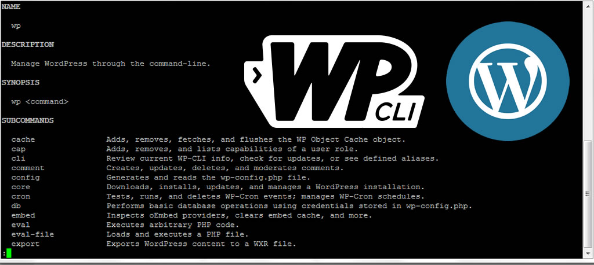

# practica01.7-iaw
Este repositorio es para la práctica01.7 de Git del módulo IAW

1.	Usaremos la misma máquina de la práctica01.6-iaw

2. Iremos al laboratorio de nuestro AWS y descargaremos la key SSH en formato PEM. Renombramos el archivo a "vockey.pem" y la colocamos en una carpeta. 

3.  Nos conectamos a la máquina mediante ssh con el comando "ssh -i "vockey.pem" ubuntu@[IP publica de la máquina]".

4.  Ahora nos dirigiremos al Visual Studio Code, descargamos la extensión "Remote - SSH" para poder conectarnos a la máquina. Con CTRL + SHIFT + P abriremos el archivo de configuración de SSH y colocamos los siguientes datos.

# Usamos la misma carpeta conf y el archivo 000-default.conf (Archivo de configuración) de la práctica01.6-iaw
### Configuración
~~~
ServerSignature Off
ServerTokens Prod
<VirtualHost *:80>
  #ServerName www.example.com
  ServerAdmin webmaster@localhost
  DocumentRoot /var/www/html

  <Directory "/var/www/html">
    AllowOverride All
  </Directory>

  ErrorLog ${APACHE_LOG_DIR}/error.log
  CustomLog ${APACHE_LOG_DIR}/access.log combined
</VirtualHost>
~~~
# Usamos la misma carpeta htaccess y archivo .htaccess de la práctica01.6-iaw
~~~
# BEGIN WordPress
<IfModule mod_rewrite.c>
RewriteEngine On
RewriteBase /
RewriteRule ^index\.php$ - [L]
RewriteCond %{REQUEST_FILENAME} !-f
RewriteCond %{REQUEST_FILENAME} !-d
RewriteRule . /index.php [L]
</IfModule>
# END WordPress
~~~
# Usamos la misma carpeta php y archivo index.php de la práctica01.6-iaw
~~~
<?php

phpinfo();

?>
~~~
# Creación de la carpeta scripts y archivo .env (Variables para el deploy_wordpress_wpcli.sh)
## Configuramos las variables
~~~
WORDPRESS_DB_NAME=wordpress
WORDPRESS_DB_USER=alexg
WORDPRESS_DB_PASSWORD=1234
WORDPRESS_DB_HOST=localhost
IP_CLIENTE_MYSQL=localhost

WORDPRESS_TITLE="Sitio web de IAW"
WORDPRESS_ADMIN_USER=admin
WORDPRESS_ADMIN_PASS=admin
WORDPRESS_ADMIN_EMAIL=demo@demo.es

CB_MAIL=alexg@iaw.com
CB_DOMAIN=practica6-wordpress.ddns.net
~~~
# Usamos el mismo install_lamp.sh de la práctica01.6-iaw
## Muestra todos los comandos que se van ejecutando
set -ex

## Actualizamos los repositorios
apt update

## Actualizamos los paquetes
apt upgrade -y

## Importamos archivo .env
source .env

## Instalamos el servidor web Apache
apt install apache2 -y

## Instalamos el gestor de bases de datos MySQL
apt install mysql-server -y

## Instalamos PHP
apt install php libapache2-mod-php php-mysql -y

## Copiamos le archivo conf de apache
cp ../conf/000-default.conf /etc/apache2/sites-available

## Reiniciamos el servicio de Apache
systemctl restart apache2

## Copiamos el archivo .php
cp ../php/index.php /var/www/html

## Modificamos el propietario y el grupo del directorio /var/www/html
chown -R www-data:www-data /var/www/html

# Usamos el mismo archivo setup_letsencrypt_certificate.sh de la práctica01.6-iaw
## Muestra todos los comandos que se van ejecutando
set -ex

## Actualizamos los repositorios
apt update

## Actualizamos los paquetes
#apt upgrade -y

## Importamos el archivo de variables .env
source .env

## Instalamos y actualizamos snapd
snap install core && snap refresh core

## Eliminamos cualquier instalación previa de certbot con apt
apt remove certbot

## Instalamos la aplicación certbot
snap install --classic certbot

## Creamos un alias para la aplicación certbot
ln -fs /snap/bin/certbot /usr/bin/certbot

## Ejecutamos el comando certbot
certbot --apache -m $CB_MAIL --agree-tos --no-eff-email -d $CB_DOMAIN --non-interactive

## Configuramos que las peticiones a HTTP se redirijan a HTTPS
### Copiamos el archivo de configuración de VirtualHost para HTTP
cp ../conf/000-default.conf /etc/apache2/sites-available

## Habilitamos el módulo rewrite
a2enmod rewrite

## Sustituimos el nombre del dominio
sed -i "s/PUT_YOUR_DOMAIN_HERE/$OPENSSL_COMMON_NAME/" /etc/apache2/sites-available/default-ssl.conf

## Reiniciamos el servicio de Apache
systemctl restart apache2

# Creación del deploy_wordpress_wpcli.sh
## Muestra todos los comandos que se van ejecutando
set -ex

## Actualizamos los repositorios
apt update

## Actualizamos los paquetes
#apt upgrade -y

## Importamos el archivo de variables .env
source .env

## Eliminamos descargas previas de wp-cli
rm -rf /tmp/wp-cli.phar

## Descargamos la utilidad wp-cli
wget https://raw.githubusercontent.com/wp-cli/builds/gh-pages/phar/wp-cli.phar -P /tmp

## Damos permisos de ejecución al archivo wp-cli.phar
chmod +x /tmp/wp-cli.phar

## Movemos la utilidad wp-cli al directorio /usr/local/bin
mv /tmp/wp-cli.phar /usr/local/bin/wp

## Eliminamos instalaciones previas de WordPress
rm -rf /var/www/html/*

## Descargamos el código fuente ed WordPress en /var/www/html
wp core download --locale=es_ES --path=/var/www/html --allow-root

## Creamos la base de datos y el usuario para WordPress
mysql -u root <<< "DROP DATABASE IF EXISTS $WORDPRESS_DB_NAME"
mysql -u root <<< "CREATE DATABASE $WORDPRESS_DB_NAME"
mysql -u root <<< "DROP USER IF EXISTS $WORDPRESS_DB_USER@$IP_CLIENTE_MYSQL"
mysql -u root <<< "CREATE USER $WORDPRESS_DB_USER@$IP_CLIENTE_MYSQL IDENTIFIED BY '$WORDPRESS_DB_PASSWORD'"
mysql -u root <<< "GRANT ALL PRIVILEGES ON $WORDPRESS_DB_NAME.* TO $WORDPRESS_DB_USER@$IP_CLIENTE_MYSQL"

## Creamos el archivo wp-config
wp config create \
  --dbname=$WORDPRESS_DB_NAME \
  --dbuser=$WORDPRESS_DB_USER \
  --dbpass=$WORDPRESS_DB_PASSWORD \
  --path=/var/www/html \
  --allow-root

## Instalamos WordPress
wp core install \
  --url=$CB_DOMAIN \
  --title="$WORDPRESS_DB_TITLE" \
  --admin_user=$WORDPRESS_ADMIN_USER \
  --admin_password=$WORDPRESS_ADMIN_PASS \
  --admin_email=$WORDPRESS_ADMIN_EMAIL \
  --path=/var/www/html \
  --allow-root
  
## Actualizamos los plugins
wp core update --path=/var/www/html --allow-root

## Actualizamos los temas
wp theme update --all --path=/var/www/html --allow-root

## Instalamos un tema
wp theme install $TEMA --activate --path=/var/www/html --allow-root

## Actualizamos los plugins
wp plugin update --all --path=/var/www/html --allow-root

## Instalamos los plugins
wp plugin install $PLUGIN --activate --path=/var/www/html --allow-root
wp plugin install $PLUGIN2 --activate --path=/var/www/html --allow-root

## Cambiamos la estructura de las url
wp rewrite structure '/%postname%/' --path=/var/www/html --allow-root

## Cambiamos el /login por lo que nosotros queramos del plugin hide-login
wp option update whl_page 'acceso' --path=/var/www/html --allow-root

## Copiamos el archivo .htaccess en /var/www/html
cp ../htaccess/.htaccess /var/www/html